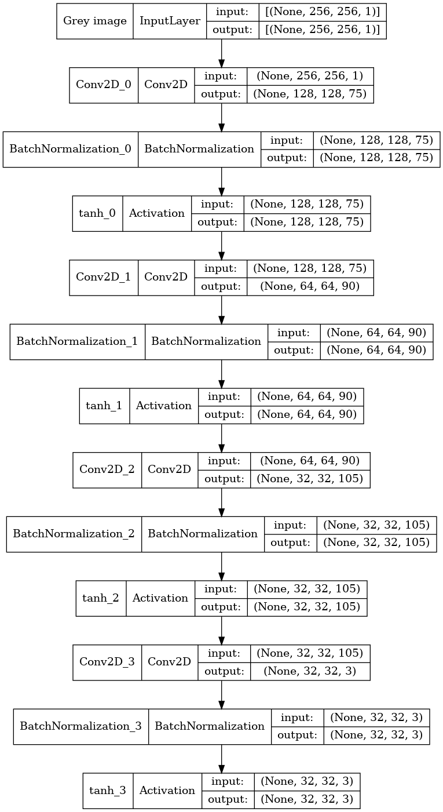
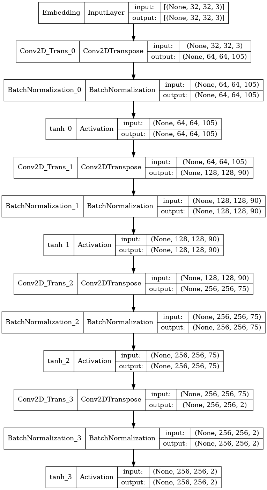

# Colorization of Grey Images by applying a Convolutional Autoencoder on the Jetson Nano
## by Dennis Konkol and Tim Niklas Witte

This repository contains an pretrainied convolutional autoencoder for colorization of grey images.
The live camera stream will be colorizatized in real time.
The architecture of the ANN is optimized to run on the Jetson Nano.
In total, 10 FPS can be archived on this embedded GPU.


## Requirements

- TensorFlow 2
- OpenCV 3.3.1

## Model

```bash
 Model: "autoencoder"
_______________________________________________________________
 Layer (type)                Output Shape            Param #   
===============================================================
 encoder (Encoder)           multiple                148155    
                                                               
 decoder (Decoder)           multiple                150145    
                                                                 
===============================================================
Total params: 298,302
Trainable params: 297,210
Non-trainable params: 1,092
_______________________________________________________________
```





## Usage

### Training

Run `Training.py` to start the training of the model.
Each epoch the weights are stored into `./saved_models`.
Besides, in `./test_logs` are the corresponding trainings statistics (train and test loss and also a batch of colorized test images) logged.

```bash
python3 Training.py
```

### Live colorization

The launch of `live_recolor_plot.py` opens a window as shown in the GIF at the start of this README.

```bash
python3 live_recolor.py
```

It has the following structure:

```bash
(1) | (2) | (3) | (4)

(1) = live RGB camera image
(2) = live grey camera image
(3) = live colorized image
```

To get also displayed a loss plot (mean squared error between `(1)` and `(3)`),
run `live_recolor_plot.py` instead.
The loss plot is presented right from `(3)`.

```bash
python3 live_recolor_plot.py
```

### Pretrainied Model

The model was runned for 13 epochs and its weights are stored in `./saved_models`.
Note that, the grey images must have a shape of `(256,256,1)`.
The following code will load the model and colorized an image:

```python3
autoencoder = Autoencoder()
autoencoder.build((1, 256, 256, 1)) # need a batch size
autoencoder.load_weights("./saved_models/trainied_weights_epoch_12")
autoencoder.summary()

grey_img = ... # grey_img.shape = (256,256,1)
grey_img = np.expand_dims(grey_img, axis=0) # add batch dim
colorized_img = autoencoder(grey_img)
```
